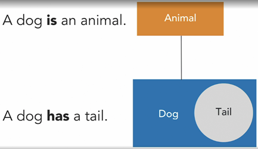
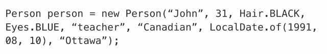

# Design Patterns
 Design Patterns is a way to structuring code to solve a specific problem.  
The aim is to make use of solutions to common problems and make code more elegant and flexible.
`No knowledge of obscure code is required.`

* Original idea from the Design Patterns: Elements of Reusable Object-Oriented Software
* Written by the <b> Gang of Four </b>

## Behavioral Design Patterns
These are about how objects assign responsibilities between each other.
They're concerned with how objects are connected, how they communicate with each other and
how responsibilities are assigned between them.

There are two different types of Behavioral Design Pattern, class patterns and objects patterns. 
You can think different between them as difference between **IS A** and **HAS A** relationships. 

For example:

| Behavioral Class Patterns | Behavioral Object Patterns |
|-----  | ----- |
|How classes share responsibilities between themselves| How different objects interact with each other|
|Focus in inheritance| Use composition|

### Chain of Responsibility Pattern
* Passes along a request until it is handled. 
* Decouples the sender from the receiver.  

| **Example Use Cases**  | **Things to Watch Out For** |
|-----  | ----- |
| Handling authentication.                     | Circular chains.              |
| Servlet filters for handling HTTP requests.  | Requests never getting handled. |
|.| Confusing stack traces. |

### Command Pattern
* Encapsulates a request inside an object. 
* Decouples the object that invokes the command from the object that knows how to handle it.

**Sometimes Used For** 
* Supporting undo/redo operations. 
* Queueing or logging request to be performed at different times.

### Interpreter Pattern
* The context: 
If you were translating a sentence into another language, the context would be the sentence (is often just a String).
* The abstract expression class: 
This is an interface or an abstract class that defines a method used for interpreting the context.
Each time there's interpret method is called, the context has changed in some way.
* The implementations of the abstract expression (terminal and non-terminal):
A non-terminal expression cause the interpret method, which alters the context, and then it passes the context onto another expression until it reaches the terminal expression. 
A terminal expression is the last time the interpret method gets called. 
* The client: It which will create instances of expressions to interpret the context.

  Components of Interpreter Pattern.

**Use Cases**
* Custom regular expressions
* Compilers
* Language translators

**Key Points**
* Express a problem as a sentence
* Define grammar
* Build an abstract syntax tree
* Easy to extend or implement the grammar
* Works best with simple grammar

###Iterator Pattern

* Iterators provide a way to access the items in a collection
* They hide underlying structure
* Real and often used examples in Java are the Iterable and Iterator interfaces