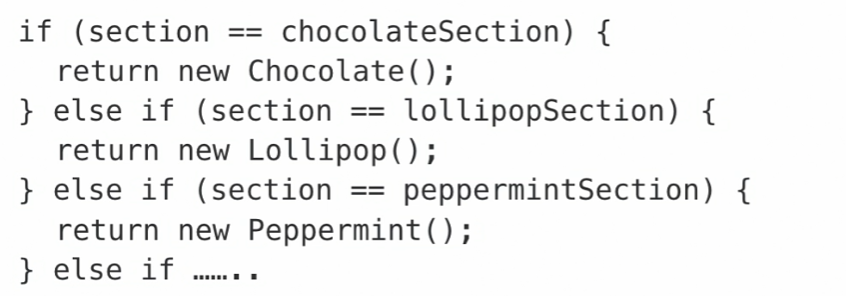

Design Patterns
Is a way of structuring code to solve a specific problem 
The aim is always to make use of solutions to common problems
and make code more elegant and flexible.
Gang of Four
1. Erich Gamma 2. Richard Helm 3. Ralph Johnson 4. John Vlissides

###Builder Pattern
Avoid using complex constructors.
Long lists of parameters are confusing.

Sometimes not all info is needed.
The telescoping constructor pattern is also too complex.

### Singleton Pattern
Limit instances of a class to one.
Avoid overusing the Singleton pattern. Consider refactoring
a codebase with many instances of the Singleton pattern.

Examples of Use Cases
*Window managers
*Database connectors
*File Managers
*UI Dialogs
*Resource allocators and spoolers

### Prototype Pattern
It is useful when making new objects memory intensive
and also useful when classes are loaded dynamically.
Cloned objects can be modified.

### The Factory Pattern
The factory method: Used when a class doesn't know exactly what object types need to be created.
Reduce all code is in one long class.

### Abstract Factory Pattern
Provides a interface for creating families of objects without specifying what
their concrete types are.
Creates families of objects.

The BikeBuilder just wants to ask for parts and be given them, not make them.

Promotes consistency. Because, it returns a specific piece we want.

