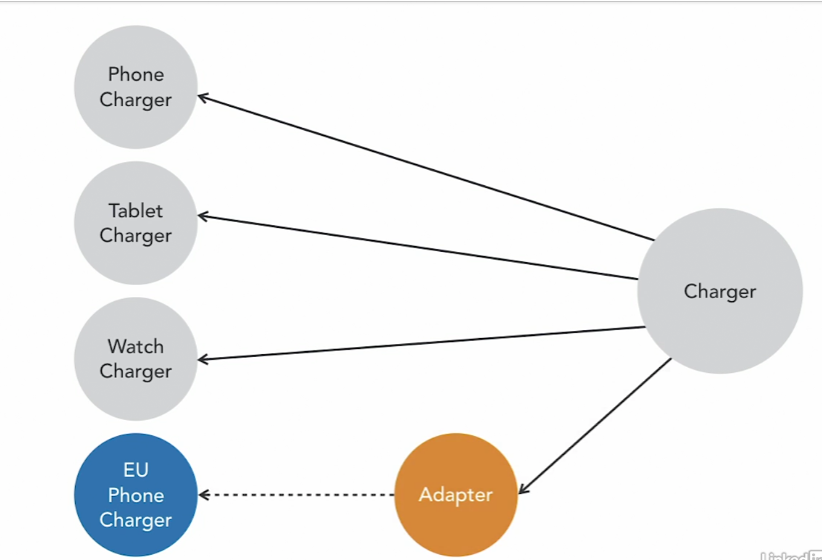

Design Patterns

Provide a guideline.
Help solve common problems.
Will make  you a better developer.

Structural Design Patterns
Class and Objects patterns different is identify the relationships.

Structural Class Patterns
How classes are structured and interact.
Focus on inheritance.

Structural Object Patterns
Object composition.
Allow objects to change behavior at runtime.

###Adapter Pattern

You can't change the source code.
You might not have access.
You are reusing legacy code.
You don't want to touch it.

You want to use an existing class, and it doesn't fit into your hierarchy.

JDK Examples
java.util.Collections.list()
java.util.Collections.enumeration()
java.util.Collections.asList()