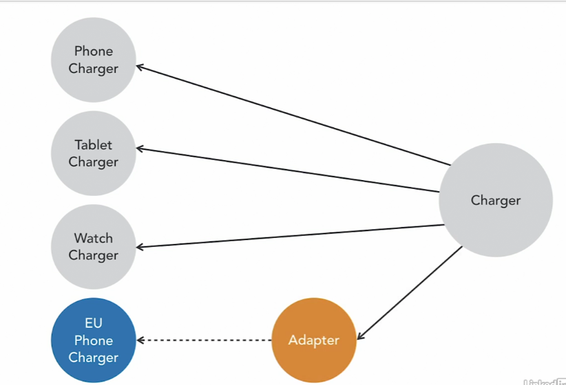
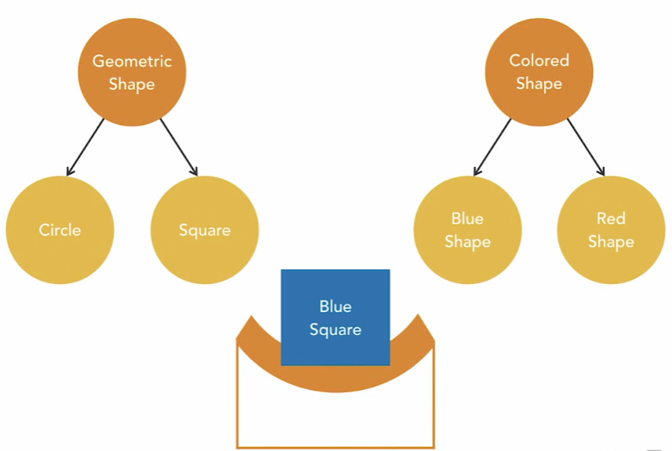
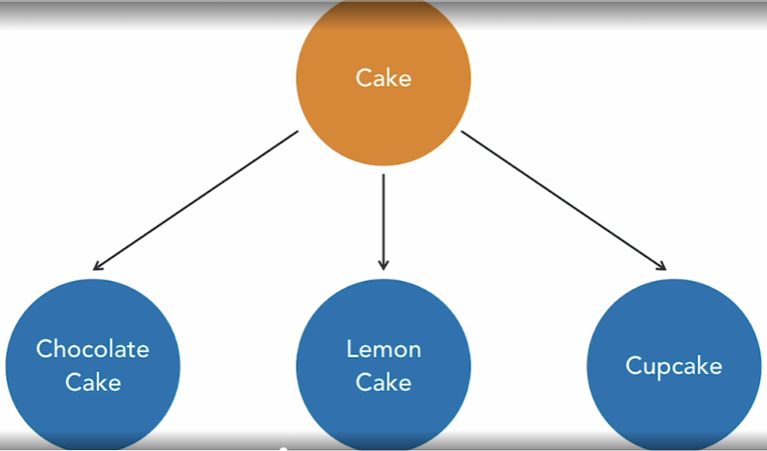

Design Patterns

Provide a guideline.
Help solve common problems.
Will make  you a better developer.

Structural Design Patterns
Class and Objects patterns different is identify the relationships.

Structural Class Patterns
How classes are structured and interact.
Focus on inheritance.

Structural Object Patterns
Object composition.
Allow objects to change behavior at runtime.

###Adapter Pattern

You can't change the source code.
You might not have access.
You are reusing legacy code.
You don't want to touch it.

You want to use an existing class, and it doesn't fit into your hierarchy.

JDK Examples
java.util.Collections.list()
java.util.Collections.enumeration()
java.util.Collections.asList()

### Bridge Pattern
This design pattern allow to avoid the complexity and dependency between class.
When you create a unique class for specific shape or color.

The bridge pattern enables me to instantiate a blue square object.
For example, without needing to write a blue square class.
Instead, I can use the characteristics of both the square class and the blue shape class.
In this way, the bridge pattern can help me to write more maintainable code,
it decouples the concrete implementation from the interface, and gives me more flexibility.

### Composite Pattern
The composite pattern is used when single objects and multiple objects should be treated uniformly.

### Decorator Pattern
If you are representing this in java code, you might have interface called Cake,
and beneath that the different types of cake.

*To add additional responsibilities to an object dynamically.
*When you want more flexibility than subclassing allows.

### Facade Pattern
A facade is used to allow the user to perform complex processes with simple actions

Benefits:
*Easier to use complex code.
*Promotes loose coupling.
*Not enforced.

### Flyweight Pattern
Flyweight objects allow you to share the intrinsic states, so the stuff is
the same for every object. Information about the extrinsic states can be passed to the Flyweight objects
when it needs it. The flyweight objects can't make any assumptions about the external states,
it should behave in the same way as an object that's not shared. 

Avoid outOfMemory using same position of the character in different objects.
Intrinsic State: Character code
Extrinsic State: Position on page -> Character code (Flyweight object)

### Proxy Pattern
Virtual proxies improve performance.
Inexpensive Operations: getWidth(), getHeight()
Expensive Operations: loadImageFromDisk.

Common Uses of thhe Proxy Pattern:
For representing large objects in a GUI.
For representing expensive database operations.
Authenticating access.